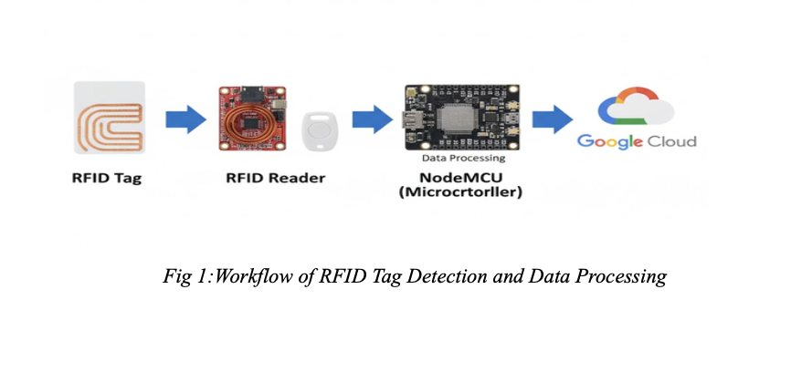
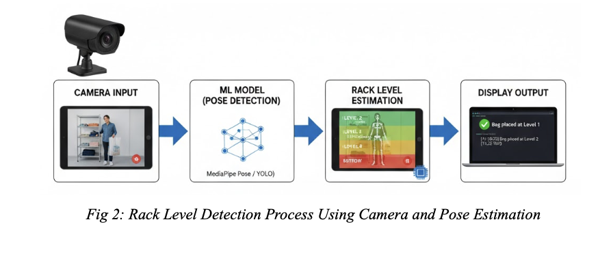
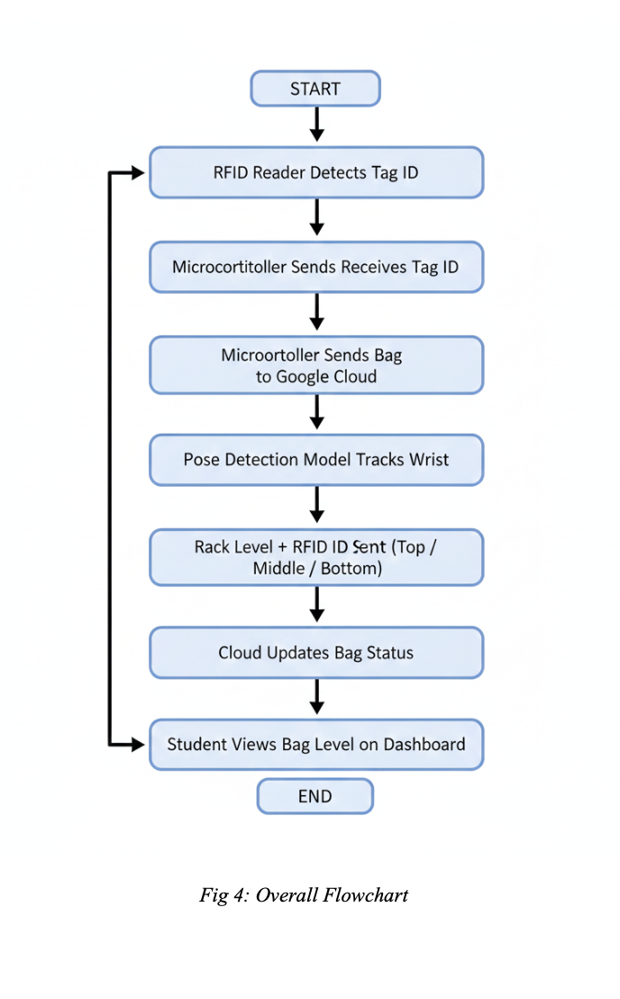
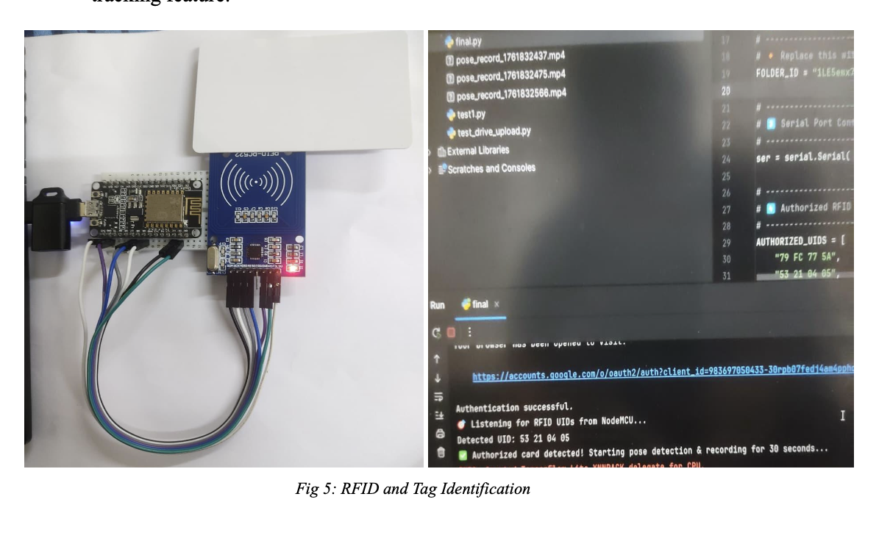

# 🧺 Smart Laundry Tracking System using RFID & Computer Vision

An IoT-based smart tracking system that combines **RFID hardware** and **computer vision** to automatically monitor, identify, and track laundry items in real time.

This project was built to demonstrate **hardware–software integration, device interfacing, and system-level validation** in an embedded + IoT environment.

---

## 🚀 Features

* 📡 **RFID-Based Identification**
  Each laundry bag/item is tagged and uniquely identified using RFID.
  
  

* 🎥 **Computer Vision Rack Detection**
  Camera + OpenCV used to detect rack positions and assist in tracking placement.
  
  

* ☁️ **Real-Time Data Logging**
  Item movement and status updates stored in a cloud/database system.

* 🧠 **Automation & Monitoring Dashboard**
  Python-based system to log, track, and monitor laundry item status.

* 🔧 **Hardware + Software Integration**
  Combines embedded interfacing with high-level processing.

---

## 🛠 System Architecture

**RFID Tag → RFID Reader → Embedded Controller → Python Processing → Database/Cloud → Monitoring Interface**

---

## Overall Flow

---

## 📈 Results 

**Data logging**

**Detection and final result** 

---

## 🔩 Hardware Components

* RFID Tags
* RFID Reader Module
* Microcontroller (ESP32 / Arduino depending on setup)
* Camera Module
* Power Supply & Interface Circuitry

---

## 💻 Software Stack

* Python
* OpenCV
* Embedded C / Microcontroller firmware
* Serial Communication (UART)
* Database / Cloud logging system

---

## ⚙️ How It Works

1. Each laundry item carries an RFID tag.
2. When items move through racks, the RFID reader detects tag IDs.
3. Camera system identifies rack position.
4. Python program processes both inputs.
5. Data is logged and item location/status is updated in the system.

---

## 🧪 Engineering Learning Outcomes

* RFID hardware interfacing
* Embedded-to-PC communication
* Sensor integration & data acquisition
* System-level debugging
* IoT data logging workflows
* Computer vision in real-world systems

---

## 📌 Applications

* Smart inventory systems
* Industrial tracking
* Warehouse automation
* Hospital linen management
* Asset tracking solutions

---

## 👨‍💻 Author

**Pushpak Srinivas Murthy Saviti**
Embedded Systems | PCB Design | IoT | Firmware | Hardware Validation

